# LAB 1 - Scanner, Analisador Léxico, Regexp e Autômato Finito

**Faculdade:** PUC-SP
**Curso:** Ciência da Computação
**Disciplina:** Compiladores
**Equipe:** - Gabriel Azevedo Cruz
- Matheus Carvalho Reis

---

## 📌 Sobre o Laboratório
Este repositório contém as entregas referentes ao LAB 1, focadas na construção e compreensão da primeira fase de um compilador: o Analisador Léxico (Scanner). As atividades exploram desde o conceito de fluxo de caracteres até a implementação de um mini-scanner estruturado.

---

## 💻 Atividades Realizadas

### Atividade 1: Bash no Terminal Linux (Simulando o "fluxo de entrada")
Criamos um script bash (`scanner_simples.sh`) executado via terminal para ler um arquivo de código fonte (`exemplo.c`). O script utiliza o comando `tr` para remover espaços, tabs e quebras de linha, simulando como o compilador enxerga o *character stream* de forma contínua antes de iniciar a tokenização.

**Evidência:**
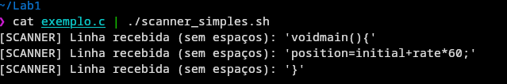

### Atividade 2: Expressões Regulares (Regex)
Utilizamos a ferramenta online Regex101 para modelar expressões regulares capazes de identificar os tokens da linguagem. 

**Explicação da Regex Unificada:**
Resolvemos o desafio de capturar toda a string `position = initial + rate * 60` com uma única regra: `[a-zA-Z_][a-zA-Z0-9_]*|\d+|[=+\-*]`
1. Utilizamos a flag global (`/g`) para garantir que o analisador varra toda a string de entrada, e não pare no primeiro token encontrado.
2. A regex combina três padrões usando o operador lógico OU (`|`): identificadores (começando com letra), números (`\d+`) e operadores matemáticos.
3. Os espaços em branco foram ignorados com sucesso, pois não correspondem a nenhuma das regras do autômato.

**Evidência Principal (Tokens do Compilador):**
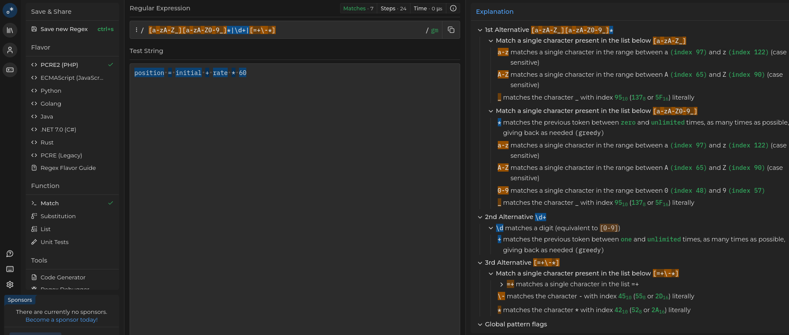

**Evidências Extras (Validação de Dados):**
Criamos e testamos expressões regulares para validação de dados reais:
* **CPF:** `\d{3}\.\d{3}\.\d{3}-\d{2}`
* **Telefone:** `\(\d{2}\)\s\d{4,5}-\d{4}`
* **E-mail:** `[a-zA-Z0-9._%+-]+@[a-zA-Z0-9.-]+\.[a-zA-Z]{2,}`

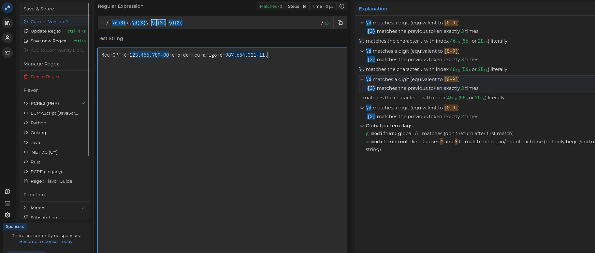

### Atividade 3: Find/Replace com regex em editores de texto
Aplicação de expressões regulares em editores de código (VS Code) para manipulação e limpeza de dados em lote. Foram realizados três exercícios:
1. Remoção de comentários `//` e `/* */` de um arquivo C.
2. Substituição de operadores de igualdade `==` por `:=`.
3. Limpeza e formatação de um arquivo CSV (remoção de espaços, conversão de decimais e troca de delimitadores).

**Evidências:**
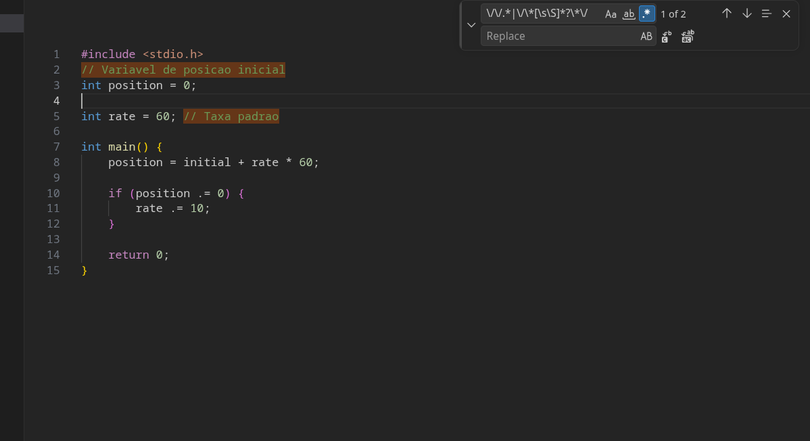
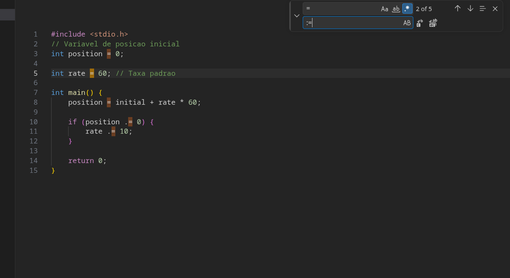
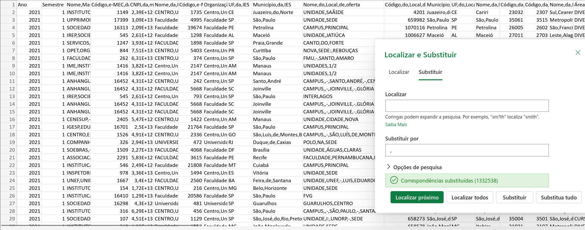

### Atividade 4: RegExp em Python e Java (O Mini-Scanner)
Nesta etapa, aplicamos as expressões regulares na prática para construir um mini-scanner funcional em **Python** e **Java**. O objetivo foi além de apenas encontrar os lexemas: precisávamos classificá-los corretamente em categorias (Tokens) utilizando o recurso de **Grupos Nomeados** das regex.

Para o desafio final em Java, implementamos uma **Tabela de Símbolos** baseada em um `LinkedHashMap` para mapear os identificadores. Isso nos permitiu replicar a saída exata do analisador léxico demonstrada na Figura 1.7 do clássico livro de Compiladores (Dragon Book): `<id, 1> <=> <id, 2> <+> <id, 3> <*> <60>`.

**Evidências da Implementação:**

* **Scanner em Python:** Utilizando a biblioteca `re` e a função `finditer` para gerar a lista de tuplas `(tipo, lexema)`.
  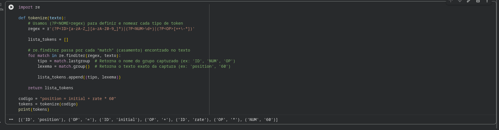

* **Scanner em Java:** Utilizando as classes `Pattern` e `Matcher`, integradas com a Tabela de Símbolos.
  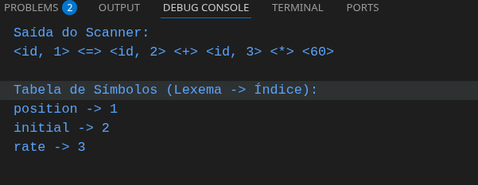

### Atividade 5: Autômatos Finitos com JFLAP
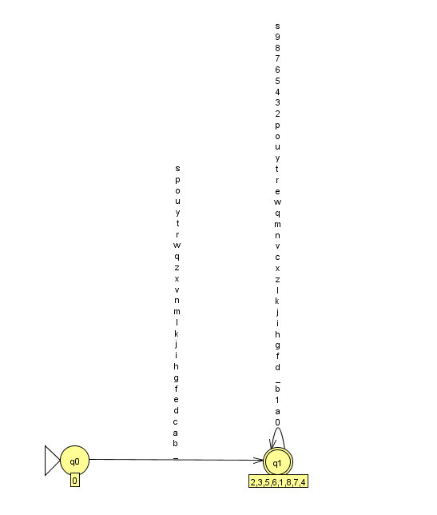

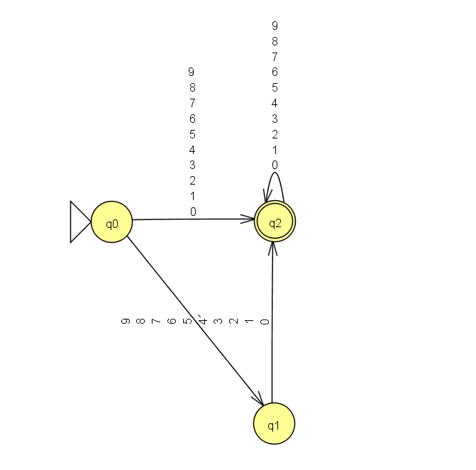

### Atividade 6: OpenAI Tokenizer × Tokens de Compilador
Nesta atividade, comparamos a forma como um compilador e um modelo de linguagem (LLM) enxergam "tokens". Utilizamos o exemplo clássico do *Dragon Book* (`position = initial + rate * 60`) no Tokenizer da OpenAI.

**Evidência:**
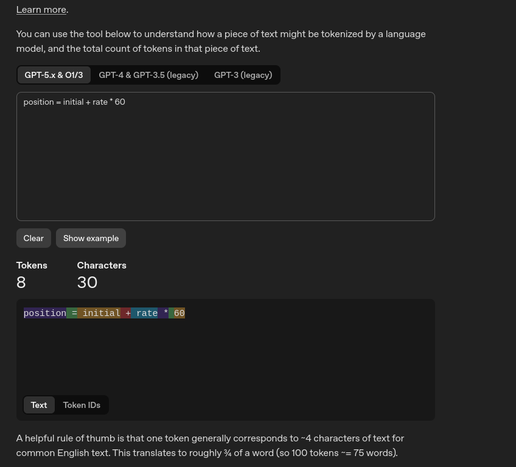

**Respostas do Grupo:**
* **Por que o tokenizer da OpenAI quebra `position` em `pos` + `ition`?**
  Diferente de um compilador, a IA não sabe o que é uma "variável" no contexto de código. O modelo utiliza um algoritmo chamado BPE (*Byte Pair Encoding*), que agrupa pedaços de texto com base na **frequência estatística** em que aparecem na internet. Como os fragmentos `pos` e `ition` são extremamente comuns na língua inglesa, a IA os separa em sub-palavras (*subwords*) para economizar processamento e memória, em vez de tratá-los como um identificador único.

* **Qual é a diferença conceitual entre token léxico e token de LLM (BPE)?**
  * **Token Léxico (Compilador):** É **determinístico e baseado em regras estritas** (gramática regular/autômatos). Ele classifica pedaços de texto em categorias rígidas predefinidas (como `ID`, `NUM`, `OP`) para garantir a sintaxe exata da linguagem de programação.
  * **Token de LLM (BPE):** É **estatístico e focado em compressão**. Ele fatia o texto nos pedaços mais comuns que já mapeou no treinamento. Não se importa com regras gramaticais ou categorias lógicas num primeiro momento, focando apenas em codificar o texto da forma mais eficiente possível.

**Discussão final em plenária: Por que o scanner de compilador precisa ser preciso e seguir a gramática, enquanto o da OpenAI não?**
A diferença fundamental está no objetivo de cada sistema. O compilador traduz instruções para a máquina, um ambiente que não tolera ambiguidades; um caractere errado ou classificado de forma incorreta resulta em erro de compilação ou falha na execução do software. A precisão absoluta é obrigatória. Por outro lado, a OpenAI lida com a linguagem natural humana, que é orgânica, cheia de gírias, neologismos e erros de digitação. Se o Tokenizer da IA fosse rígido como um compilador, ele travaria ao encontrar qualquer palavra nova fora do dicionário. O modelo estatístico fornece à IA a flexibilidade necessária para compreender a bagunça da comunicação humana juntando pequenos fragmentos de texto.

### Atividade 7: Tokenizar livro em português (O Scanner em Larga Escala)
Nesta atividade final, escalamos nosso mini-scanner para processar um fluxo de entrada real e volumoso: um livro inteiro em português em formato `.txt` (UTF-8), obtido no Project Gutenberg.

O principal desafio técnico foi modelar uma Expressão Regular que respeitasse a gramática da língua portuguesa, capturando palavras completas (incluindo caracteres acentuados e hífens) e isolando as pontuações como tokens individuais, descartando espaços e quebras de linha.

**Evidencia**
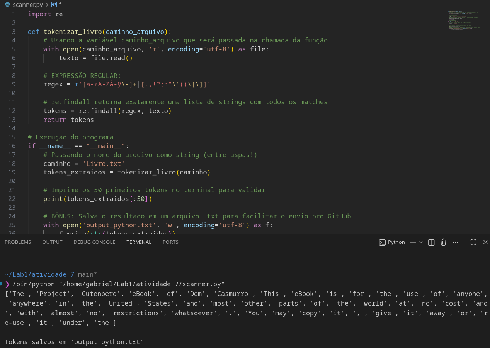
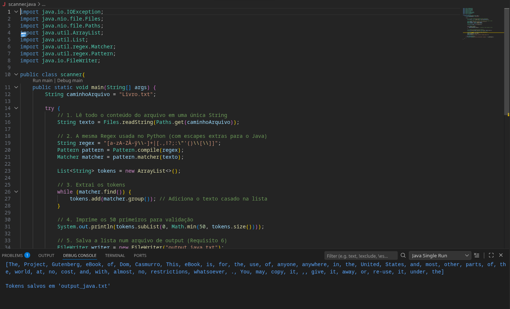
**A Expressão Regular utilizada:**
  regex
[a-zA-ZÀ-ÿ\-]+|[.,!?;:"'()\[\]]

---

## 🧠 Conclusões Individuais
[Espaço reservado para o parágrafo final da dupla]
